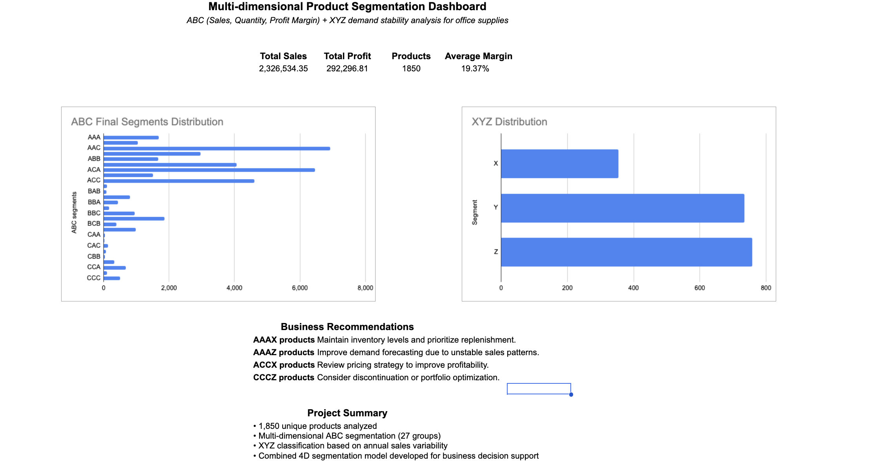

# Multi-dimensional Product Segmentation (ABC + XYZ)


## Project Overview

This project demonstrates how Google Sheets can be used to perform a multi-dimensional product segmentation analysis using ABC and XYZ methodologies.

Unlike a traditional ABC analysis based solely on sales revenue, this project extends the segmentation by evaluating products across three business dimensions:

- Sales contribution
- Sales volume (Quantity)
- Profitability (Profit Margin)

The final product classification is combined with XYZ demand stability analysis to create a four-dimensional segmentation model that supports inventory planning and portfolio optimization.

---

## Business Problem

Companies often manage hundreds or thousands of products with very different sales patterns and profitability.

Treating every product equally can lead to:

- inefficient inventory management;
- poor demand forecasting;
- excessive stock levels;
- missed opportunities to focus on high-value products.

The goal of this project is to identify product groups that require different business strategies based on their value and demand stability.

---

## Dataset

**Dataset:** Sample Superstore

**Industry:** Office Supplies

**Products analysed:** 1,850

**Tool:** Google Sheets

---

## Project Workflow

### 1. Data Cleaning

The dataset was cleaned and validated before analysis.

Tasks included:

- removing duplicate records;
- validating numeric fields;
- checking missing values;
- formatting dates;
- calculating Profit Margin.

**Profit Margin**

```
Profit Margin = Profit / Sales
```

---

### 2. Multi-dimensional ABC Analysis

Instead of performing a standard ABC analysis based only on revenue, three independent ABC classifications were created.

#### ABC by Sales

Products were classified according to their contribution to total revenue.

#### ABC by Quantity

Products were classified according to total units sold.

#### ABC by Profit Margin

Products were classified according to average profit margin.

**Note**

Profit Margin values showed very low variance across products. Standard ABC thresholds resulted in an almost identical classification for most products.

To create a more informative segmentation, custom thresholds were applied based on the actual data distribution rather than using the traditional 80–15–5 rule.

---

### 3. XYZ Analysis

Demand stability was measured using annual sales rather than monthly sales.

Monthly sales contained many zero or very small observations, making the coefficient of variation unreliable.

Annual aggregation produced a more meaningful measure of demand variability.

For every product, the following metrics were calculated:

- Average Annual Sales
- Standard Deviation
- Coefficient of Variation (CV)

Products were classified as:

- X — stable demand
- Y — moderate demand variability
- Z — highly variable demand

---

### 4. Final Product Segmentation

The final segment combines four independent classifications:

```
ABC (Sales)
+
ABC (Quantity)
+
ABC (Profit Margin)
+
XYZ
```

Examples:

- AAAX
- AACY
- ACCZ
- CCCZ

This allows products with similar revenue but different demand stability or profitability to be managed differently.

---

## Dashboard

The dashboard summarizes the results using:

- KPI cards
- ABC segment distribution
- XYZ distribution
- Business recommendations

---

## Key Findings

- Revenue is concentrated in a relatively small number of A-class products.
- Demand stability varies considerably across the product portfolio.
- Several products generate strong sales but relatively low profit margins.
- Custom Profit Margin segmentation provides more meaningful business insights than standard ABC thresholds.
- Combining ABC and XYZ analyses enables more targeted inventory and portfolio management.

---

## Business Recommendations

### AAAX — Core Products

Maintain high inventory availability and prioritize replenishment.

### AAAZ — High Value but Unstable Demand

Improve demand forecasting and closely monitor inventory levels.

### ACCX — Stable but Lower Profitability

Review pricing strategy, supplier costs, and discount policies.

### CCCZ — Low Performance Products

Evaluate for discontinuation or replacement with more profitable alternatives.

---

## Skills Demonstrated

- Google Sheets
- Pivot Tables
- XLOOKUP
- INDEX / MATCH
- IF functions
- Logical formulas
- Data Cleaning
- Conditional Formatting
- Dashboard Design
- Business Analysis
- ABC Analysis
- XYZ Analysis
- Product Segmentation

---

## Repository Structure

```
abc-xyz-product-segmentation/
│
├── data/
│   └── Sample-Superstore.csv
│
├── screenshots/
│   ├── dashboard.png
│   ├── abc-analysis.png
│   ├── xyz-analysis.png
│   └── segmentation.png
│
└── README.md
```

---

## Future Improvements

Possible extensions of the project include:

- inventory optimization analysis;
- safety stock calculations;
- interactive dashboard filters;
- Power BI implementation;
- SQL integration for automated reporting.
